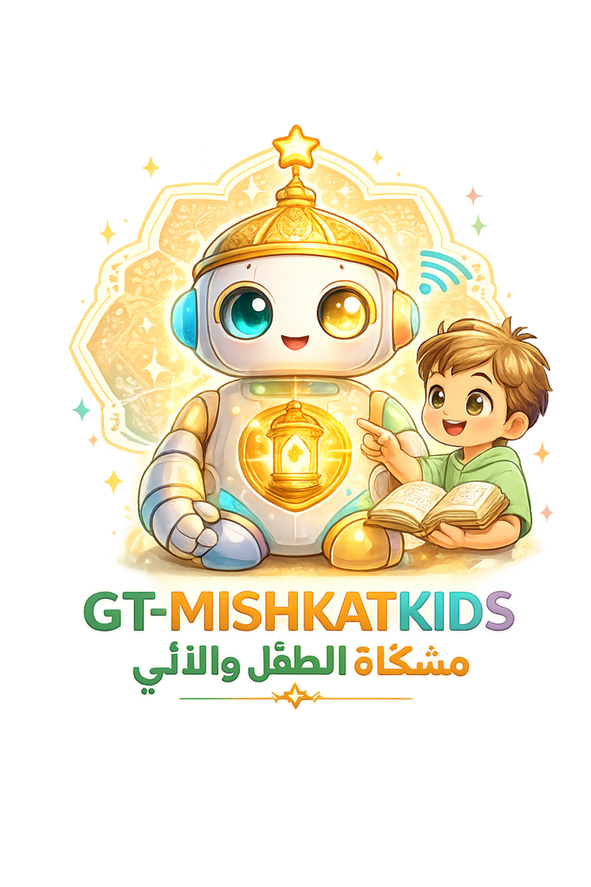

<div dir="rtl">

<p align="center"></p>

# مِشكاةُ الطفلِ والآليّ 🪔

### *Mishkat — The Child & the Robot*

> **الطفلُ يُعلّم، والآليُّ يَستنير.** نظامٌ تعليميّ للأطفال (4–10 سنوات) بفكرةٍ معكوسة: **الطفل هو المعلّم** — يُعيدُ تعليم آليٍّ صديقٍ (الآليّ) فقَدَ ذاكرته، فيتعلّمُ وهو يُعلّم، عبر أنشطةٍ واقعيّةٍ يفعلها بيديه. وكلّما علّمه ذكرى، **أضاء جزءٌ من الآليّ واستعاد نشاطَه** — كأنّ الطفلَ يُنيرُ المِشكاة (نورَ العلم).

**محليّ بالكامل · يعمل دون اتصال · بلا ذكاء اصطناعي وقت التشغيل · بلا تكلفة · بيانات الطفل لا تغادر الجهاز · إطارٌ إسلاميٌّ عقديّ.**

### 🌐 جرّبه مباشرةً عبر المتصفّح
**الموقع الرسميّ:** <https://salehgnutux.github.io/GT-MISHKATKIDS/> — صفحةُ تعريفٍ بخيارات الاستخدام.
**التطبيق مباشرةً:** <https://salehgnutux.github.io/GT-MISHKATKIDS/app/home.html>

| الاستخدام | الحالة |
|---|---|
| 🌐 عبر المتصفّح (PWA، قابلٌ للتثبيت ويعمل دون اتصال) | **متاحٌ الآن** |
| 🐧 حزم غنو/لينكس (AppImage · DEB · RPM) | **متاحٌ الآن** — [الإصدارات](https://github.com/SalehGNUTUX/GT-MISHKATKIDS/releases/latest) |
| 🤖 أندرويد (APK) | **متاحٌ الآن** — [الإصدارات](https://github.com/SalehGNUTUX/GT-MISHKATKIDS/releases/latest) |

---

## ✨ المبادئ
- **أثر المُتعلِّم:** نتعلّمُ أعمقَ ما نُعلّمه لغيرنا.
- **قلب الأدوار:** الطفلُ خبيرٌ واثق، والآليّ يُخطئ — أمانٌ عاطفيّ تامّ.
- **هجين:** تطبيقٌ رقميّ + طقسٌ يدويّ ومطبوعات (نشاطٌ واقعيّ أوّلًا، وقت شاشةٍ قصير).
- **خصوصيّة مطلقة:** محليّ أولًا، بلا حساب ولا تتبّع ولا سحابة.

---

## 🧩 المكوّنات
| المكوّن | الملف | الوصف |
|---|---|---|
| 🤖 التطبيق (الحلقة) | `index.html` | شرارة → مهمة → تلقين → شفاء؛ الآليّ يتعافى أمام العين |
| 👪 لوحة الأهل | داخل التطبيق | بوّابة حسابيّة · مراجعة · ضبط المجالات · مفتاح ذكريات الإخوة · توثيق صوت/صورة محليّ |
| 📚 القصص المصوّرة | `stories.html` | 8 قصص أصيلة بصورٍ كرتونيّة **كبيرة** + درسٌ ختاميّ |
| 🔤 الأساسيّات | `basics.html` | حروف (بطاقات + «أين الحرف؟») · أرقام وعدّ · حركات (فتحة/ضمّة/كسرة) — أوّل خطوات القراءة (أصيلة) |
| 📖 سُلّم القراءة | `read.html` | المقاطع ← اجمع الكلمة ← اقرأ الجملة (حرف+حركة فأكثر، بالنُّطق) — أصيلة |
| 🕌 القرآن الكريم | `quran.html` | الفاتحة + جزء عمّ بتلاوة **محمود خليل الحصري** (محلّيّة)، تظليلُ الآية + تكرارُ آيةٍ/سورةٍ للحفظ + تسجيلُ تلاوة + خطوطٌ قرآنيّة، مرتّبةٌ من الأقصر للأطول |
| 🎮 ألعاب وأنشطة | `play.html` | **ألعابٌ تنافسيّةٌ ضدّ الآليّ (بثلاث صعوبات) أو الإخوة** (دائرةٌ وعلامة · تحدّي الأعداد · صيدُ الحرف/الرقم · سباقُ المطابقة · شبكةُ الكلمات · الذاكرة، بردودٍ منطوقة) + 7 ألعابِ دمجِ حروف + ألعاب/أنشطة للطباعة (أصيلة) |
| 🏆 تقدّمي | `progress.html` | نجوم · أوسمة · سلسلة أيّام · مهمّة اليوم · شهادة إنجاز قابلة للطباعة (محليّ بالكامل) |
| 📖 قصص وعِبَر | `tales.html` | 51 قصّة قصيرة بالحركات + أسئلة فهم (مستوحاة من GT-SARARIM) |
| 🧩 ألغاز ذكية | `puzzles.html` | 61 لغزًا (فوازير ومنطق) بمستويات — تلميح وحل |
| 🎯 اختبارات تعليمية | `quiz.html` | 94 سؤال اختيار من متعدد بفئاتٍ وأعمار — نتيجة فوريّة |
| 🖨️ ألعاب/أنشطة للطباعة | `print.html` | نماذجُ ألعابٍ ورقيّةٍ جاهزةٍ للّعب (اختيارٌ فُرادى + عددُ نُسخٍ بمحتوًى مختلف) + بطاقاتُ مهام + ملصق «خريطة شفاء الآليّ» (طباعة/PDF) |
| 🏠 الفهرس | `home.html` | لوحة رئيسيّة تربط الكلّ + فهرس المكتبة (بحث وتصفية) |

روابط ذكيّة في التطبيق: `?memory=<id>` يفتح ذكرى بعينها · `?parent=1` يفتح لوحة الأهل.

---

## 📚 المحتوى
- **مجموعة GT-SARARIM (محوَّلة):** 51 قصّة (أخلاق · قرآن · أنبياء · علماء · صحابة) + 102 سؤال فهم · 61 لغزًا (فوازير ومنطق) · 94 سؤال اختبار — **نصوصها منقولةٌ من [GT-SARARIM](https://github.com/SalehGNUTUX/GT-SARARIM) (GPL-3.0)**، انظر [`docs/CREDITS.md`](docs/CREDITS.md).
- **مكتبة الذكريات:** 71 ذكرية في 5 مجالات (أرقام وهندسة · حروف ولغة · أخلاق ومشاعر · علوم وطبيعة · تفكير وحلّ مشكلات) × فئتين عمريّتين (4–6 و7–10) — منها: 9 مشاريع متعدّدة الأيّام · 5 موسميّة · 6 تعاونيّة للإخوة · 5 مهارات حياتية · 5 أمان وصحّة · 5 قدوات وقيم.
- **القصص المصوّرة:** 8 قصص بقيمٍ مختلفة — المثابرة · الصبر · الشجاعة · الصدق · التعاون · الفضول · الرحمة بالحيوان · النظافة.
- **نموذج الشفاء:** 7 أجزاء للآليّ (عينان · أذنان · فم · قلب · يدان · ساقان · دماغ) + 7 عناصر عالم (قمر · شمس · شجرة · صديق · نهر · نجمة · طائر)، و**تعودُ ضحكةُ الآليّ** عند استعادة 8 مكافآت.

---

## 🔁 كيف تعمل الجلسة
1. **الشرارة:** يومضُ في الآليّ طيفُ ذكرى («أتذكّرُ كلمةً… دائرة؟ لكنّي نسيتُ شكلها!»).
2. **المهمة:** يخرجُ الطفلُ ليفعلها في الواقع (بطاقةٌ بخطواتٍ وأدواتٍ من البيت).
3. **التلقين:** يحكي الطفلُ أو يُري ما فعل (يقرّر الأهلُ النجاح — لا حُكمَ آليّ).
4. **الشفاء:** يُضيءُ جزءٌ من الآليّ بلونه، ويرتفعُ التقدّم — والطفلُ هو من أعاده إلى الحياة.

---

## 🏗️ التقنية
- **Vite + vite-plugin-pwa:** يعمل دون اتصال (Service Worker) وقابلٌ للتثبيت كتطبيق.
- HTML/JS كوحدات، **رسوم SVG محليّة** مشتركة (`src/art.js`, `src/story-art.js`) — بلا صورٍ خارجيّة.
- البيانات JSON محليّة (`content/`). التخزين: `localStorage` (التقدّم) + `IndexedDB` (تسجيلات الصوت/الصورة).
- لا خادم · لا مفتاح · لا سحابة · لا ذكاء اصطناعي.

---

## ▶️ التشغيل
شِفرةُ التطبيق كلُّها في مجلّد **`GT-MK/`** (جذرُ المستودع يحتوي الموقعَ الرسميّ `index.html` + `README` + `LICENSE`).
```bash
cd GT-MK
npm install
npm run dev      # خادم تطوير (Vite)
npm run build    # إنتاج → GT-MK/dist/
```
ثمّ تُخدَم `GT-MK/dist/` كملفّاتٍ ثابتةٍ في أيّ مكان، أو تُفتح على اللوحية وتُثبَّت كتطبيق.
ابدأ من **`home.html`** (الفهرس).

---

## 🗂️ البنية
```
GT-MISHKATKIDS/        # جذر المستودع
├─ index.html          # الموقع الرسميّ (صفحةُ هبوطٍ تعريفيّة)
├─ assets/             # شعارات الموقع
├─ README.md · LICENSE # (GPL-3.0)
└─ GT-MK/              # التطبيق كاملاً ↓
   ├─ index.html        # التطبيق (الحلقة) + لوحة الأهل
   ├─ stories.html      # القصص المصوّرة (الأصيلة)
   ├─ basics.html       # الأساسيّات: حروف · أرقام · حركات (أصيلة)
   ├─ read.html         # سُلّم القراءة: مقاطع ← كلمات ← جُمل (أصيلة)
   ├─ play.html         # ألعاب: تنافسيّة (ضدّ الآليّ/الإخوة) + دمج حروف + طباعة (أصيلة)
   ├─ tales.html        # قصص وعِبَر + أسئلة فهم   (GT-SARARIM)
   ├─ puzzles.html      # ألغاز ذكية              (GT-SARARIM)
   ├─ quiz.html         # اختبارات تعليمية         (GT-SARARIM)
   ├─ progress.html     # تقدّمي: نجوم · أوسمة · مهمّة اليوم · شهادة (أصيلة)
   ├─ print.html        # المطبوعات
   ├─ home.html         # الفهرس (لوحة رئيسيّة) + مهمّة اليوم
   ├─ vite.config.js · package.json
   ├─ src/
   │  ├─ art.js         # رسوم المجالات/العالم + مشاهد الذكريات
   │  ├─ story-art.js   # رسوم القصص الكبيرة
   │  └─ progress.js    # تتبّع التقدّم/الأوسمة/المهمّة (localStorage)
   ├─ content/
   │  ├─ library.js            # 71 ذكرية (أصيلة)
   │  ├─ stories.js            # 8 قصص مصوّرة (أصيلة)
   │  ├─ words.js              # بنك كلمات (69 كلمة) لألعاب دمج الحروف (أصيل)
   │  ├─ letters.js            # الحروف الـ28 + الأرقام (أصيل)
   │  ├─ reading.js            # سُلّم القراءة: كلمات بمقاطعها + جُمل (أصيل)
   │  ├─ sararim-stories.js    # 51 قصّة + أسئلة فهم (GT-SARARIM)
   │  ├─ puzzles.js            # 61 لغزًا (GT-SARARIM)
   │  └─ quiz.js               # 94 سؤالًا (GT-SARARIM)
   │  (ملفّات البيانات وحداتُ ES `export default` — تعمل بلا أداة بناء)
   ├─ tools/import-from-gtsararim.mjs  # أداة تحويل المحتوى من GT-SARARIM
   ├─ public/icon.svg
   └─ docs/             # architecture · content-format · CREDITS
```

---

## 📄 الوثائق
- [`docs/architecture.md`](docs/architecture.md) — المرجع التقنيّ الحيّ (القرارات والمكوّنات).
- [`docs/content-format.md`](docs/content-format.md) — تنسيق المحتوى ونموذج الشفاء.
- [`docs/CREDITS.md`](docs/CREDITS.md) — نسبة الفضل والرخص.

---

## 🙏 نسبة الفضل والرخصة
من مشروع **[GT-SARARIM](https://github.com/SalehGNUTUX/GT-SARARIM)** (بقلم SalehGNUTUX، رخصة **GPL-3.0**):
- **إلهامٌ موضوعيّ** لذكريات «قدوات وقيم» (`role-*`) — نصُّها أصيلٌ من تأليفنا.
- **محتوًى منقولٌ مباشرةً** في `tales/puzzles/quiz`: نصوص القصص والألغاز والأسئلة **مأخوذةٌ حرفيًّا** من بيانات GT-SARARIM ← **تنطبق GPL-3.0 على هذه الأجزاء عند التوزيع** (نسبةٌ واجبة، وترخيص العمل المُوزَّع بـ GPL-3.0).

بقيّةُ «تلميذي» — الحلقة، الرسوم، المكتبة الأصليّة، القصص المصوّرة، وواجهات العرض — **أصيلةٌ من تأليفنا**. التفاصيل والأثر القانونيّ في [`docs/CREDITS.md`](docs/CREDITS.md).

> مشروعٌ عائليّ شخصيّ — صُنع بحبّ لأطفالٍ يتعلّمون وهم يُعلّمون. 🌱

</div>
